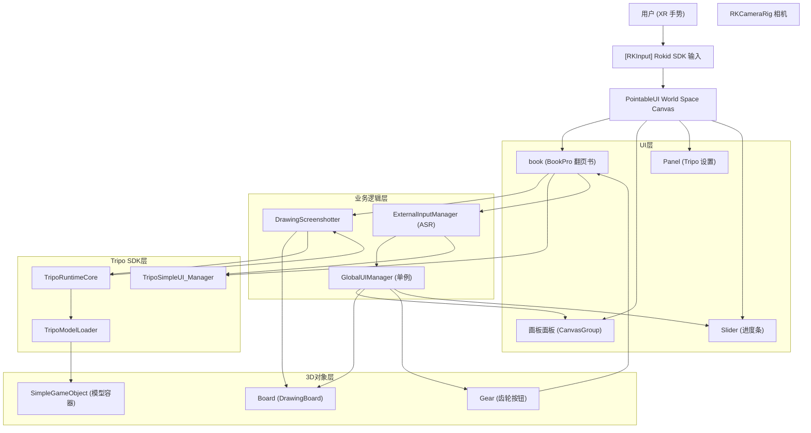

# 设计文档 — 3DGenerate 场景

## 概述

3DGenerate（虚实绘景）是一个 XR 创意场景，集成 Tripo AI SDK 提供三种3D模型生成方式：画板绘图转3D、文字描述转3D、语音输入转3D。场景基于 Rokid SDK 提供手势射线交互，使用 BookPro 翻页组件作为多页设置界面，生成的3D模型支持手势抓取。

场景路径：`Assets/kiro/3DGenerate.unity`

---

## 架构



---

## 组件与接口

### 场景根级对象（13个）

| 对象名 | 类型 | 说明 |
|--------|------|------|
| Directional Light | Light | 方向光，Pos(0,3,0)，Rot(50,-30,0) |
| [RKInput] | Prefab | Rokid SDK 输入系统 |
| PointableUI | Prefab | World Space Canvas，射线交互 UI |
| RKCameraRig | Prefab | Rokid SDK XR 相机 |
| Board | GameObject | 3D 画板，Layer=6 |
| Gear | GameObject | 齿轮设置按钮 |
| SimpleGameObject | GameObject | 生成的3D模型容器 |
| Camera_Position_W | GameObject | 相机位置标记（空对象） |
| Tripo_Manager | GameObject | Tripo SDK 管理器 |
| ASRmanager | GameObject | 语音识别管理器 |
| GlobalUIManager | GameObject | UI 总管单例 |
| BordController | GameObject | 画板控制器 |


### GlobalUIManager.cs

脚本路径：`Assets/kiro/Scripts/3DGenerate/GlobalUIManager.cs`
GUID: `ad6e8b055daf4ca49b0ce3e0874fa18c`

单例 UI 管理器，集中控制所有 UI 面板和3D物体的显隐。

| 字段 | 类型 | 绑定目标 |
|------|------|----------|
| TripoRuntimeCore | MonoBehaviour | Tripo_Manager 上的 TripoRuntimeCore 组件 |
| tripoSlider | Slider | PointableUI Canvas 下的 Slider |
| managedUICanvasGroups[0] | CanvasGroup | null（占位） |
| managedUICanvasGroups[1] | CanvasGroup | 画板面板 CanvasGroup |
| managed3DObjects[0] | GameObject | 画笔模型 |
| managed3DObjects[1] | GameObject | Board（画板） |
| managed3DObjects[2] | GameObject | Gear（齿轮） |

| 方法 | 说明 |
|------|------|
| HideAllManagedItems() | 隐藏所有受管理的 UI 面板和3D物体 |
| ShowAllManagedItems() | 显示所有受管理的 UI 面板和3D物体 |
| UpdateSlider(float value) | 更新进度条值（0~1） |
| SetSliderActive(bool active) | 设置进度条显隐 |

### DrawingScreenshotter.cs

脚本路径：`Assets/kiro/Scripts/3DGenerate/DrawingScreenshotter.cs`
GUID: `1ce8e9af3b08e1247a154bdf842bfdc2`

挂载在 BordController 对象上，截取画板内容并调用 Tripo ImageToModel API。

| 字段 | 类型 | 绑定目标 |
|------|------|----------|
| progressSlider | Slider | PointableUI Canvas 下的 Slider |
| simpleModel | GameObject | SimpleGameObject |

| 方法 | 说明 |
|------|------|
| CaptureAndSaveToFile() | 截取 DrawingBoard.drawingTexture，保存为 PNG，调用 TripoRuntimeCore.SetImagePath + ImageToModel |
| ChangeBool() | 模型生成完成回调，启用 SimpleGameObject 的 BoxCollider |

运行时通过反射查找 TripoRuntimeCore 和 DrawingBoard 组件。

### ExternalInputManager.cs

脚本路径：`Assets/kiro/Scripts/3DGenerate/ExternalInputManager.cs`
GUID: `f3e1a662f8d65024bb5a1920ca2959c2`

挂载在 ASRmanager 对象上，处理语音录音→上传→识别→文字转3D流程。

| 字段 | 类型 | 绑定目标 |
|------|------|----------|
| apiKey | string | Tripo API Key（Inspector 配置） |
| targetUIManager | MonoBehaviour | Tripo_Manager 上的 TripoSimpleUI_Manager |
| screenshotter | DrawingScreenshotter | BordController 上的 DrawingScreenshotter |
| asrUploadURL | string | http://110.40.170.159/upload |

| 方法 | 说明 |
|------|------|
| ToggleRecording() | 开始/停止录音 |
| SetApiKeyAndConfirm() | Start() 时自动设置 API Key 并触发确认 |


---

## 数据模型

### 场景层级结构

```
3DGenerate.unity
├── Directional Light              — 方向光 Pos(0,3,0) Rot(50,-30,0)
├── [RKInput] (Prefab)             — Rokid SDK 输入系统
│   GUID: fa2ab4a52b98844a5beea51c6d5ab85a
│   Position: (0.0004,-0.503,-0.0014)
├── PointableUI (Prefab)           — World Space Canvas
│   GUID: 3c20833d81e354626b8365b459274912
│   Position: (0,0,0.5), Canvas AnchoredPos.y=-0.05
│   ├── book (翻书UI容器)          — IsActive=0, CanvasGroup
│   │   ├── 设置 (TMP title)
│   │   ├── BookPro (翻书)         — Book + AutoFlip 组件
│   │   │   ├── Page0              — API Key 配置页
│   │   │   ├── Page1              — 空白页（红色背景）
│   │   │   ├── Page2              — 文字转3D页
│   │   │   ├── Page3              — 图片转3D页
│   │   │   ├── Page4              — 扩展设置页
│   │   │   └── Page5              — 功能页
│   │   └── 工具栏                 — 底部工具栏（btn_prev, 隐藏画板, btn_next, 底页）
│   ├── 画板面板 (mixBord)         — CanvasGroup(alpha=1), Scale(1.0104,1.0104,1.0104)
│   │   ├── 工具栏                 — 画笔工具栏（画笔Prefab, 颜色按钮×4, 颜色板）
│   │   └── 画笔栏                 — CanvasGroup(alpha=0, 隐藏)
│   ├── Panel (Tripo 设置面板)     — Layer=5
│   └── Slider (进度条)            — 生成进度
│       ├── Background
│       ├── Fill Area → Fill
│       ├── Sliding Area → Handle
│       └── Text (TMP "生成中...", 字号70, 深红色)
├── RKCameraRig (Prefab)           — Rokid SDK XR 相机
│   GUID: bc7bf2e56b74d4038af31f75d0b2d024
├── Board                          — 3D 画板, Layer=6
│   Position: (0.0052,-0.1091,0.55), Scale(0.5104,0.4685,0.05)
│   Components: MeshFilter(Plane), MeshRenderer, MeshCollider
│   DrawingBoard GUID: 9570213ce944ed040a1cbe4da81932fa
│   DrawingBoard 参数:
│     brushTip → Cube(笔尖)
│     brushRaycastDistance = 0.075
│     textureWidth/Height = 1024
│     brushSize = 2
│     brushColor = black
│     minPointDistance = 0.1
│     lineSubdivisions = 15
│   ├── Cube (笔尖)                — Scale(0.008,0.003,0.269)
│   ├── 木脚                       — Layer=6, Pos(0,-0.516,0.7), Scale(1.1053,0.088,2.852)
│   │   mat GUID: c36c3ccb653121243ae5908072c531b6, BoxCollider
│   └── 木枕                       — Layer=6, 类似木脚
├── Gear                           — Layer=0, BoxCollider(0.094,0.049,0.091)
│   Components: Rigidbody(kinematic), OVRGrabbable, GrabInteractable
│   Components: ColliderSurface, InteractableUnityEventWrapper
│   InteractableUnityEventWrapper._whenSelect → CanvasDragHandle.ToggleToolPanel()
│   CanvasDragHandle GUID: fd7fed06a72cabb4aa51f4b59e063adc
│   └── 设置 (TMP "设置")          — Rot(180,-32.9,-90), Scale(0.003,0.003,0.003)
│       color: (0.358,0.022,0.008,1)
├── SimpleGameObject               — Layer=0, ConstrainProportionsScale=1
│   Components: TripoModelLoader GUID 7fc354af441a35b4eab3dd86d3f8d513
│   Components: GltfImport GUID b781fe673a5534e91b1e802df4b9362e
│   Components: OVRGrabbable GUID 777565b974c474bfd8039e9bee64aaf5
│   Components: InteractableUnityEventWrapper GUID 32729db2bca2f44a0a54361d6355894e
│   Components: ColliderSurface GUID 63d092618e58346e29c8093d7c9e64a9
│   Components: GrabInteractable GUID aeb5cfd19063548bf82e24d3bb55ba85
│   Components: BoxCollider (初始 disabled)
├── Camera_Position_W              — Layer=0, 空 GameObject（同 SimpleGameObject 组件配置）
├── Tripo_Manager                  — Position(0,0,0)
│   Components: TripoSimpleUI_Manager GUID 09f032cc6eccbc44bad744f19f10d60f
│   Components: TripoRuntimeCore GUID 73b0d52bf358f9245996499886128aae
│   TripoRuntimeCore 参数:
│     modelVersion = 4
│     face_limit = 8000
│     OnModelGenerateComplete → DrawingScreenshotter.ChangeBool()
│   TripoSimpleUI_Manager 绑定:
│     btnConfirmApiKey → API_Key_Confirm
│     btnTextToModelGenerate → TextToModel_Generate
│     btnLoadImage → PreviewImageButton
│     btnImageToMdelGenerate → ImageToModel_Generate
│     ApiKeyInputField → API_Key_InputField
│     TextPromptInputField → TextToModel_InputField
│     ImagePathInputField → imagePath_InputField
│     SimpleModel → SimpleGameObject
│     ModelVersionDropdown → ModelVersionDropdown
│     ModelRotationSpeed = 50
├── ASRmanager                     — Position(0.166,0.039,-3.997)
│   Components: ExternalInputManager, AudioSource
│   ExternalInputManager 参数:
│     apiKey = [配置的 API Key]
│     targetUIManager → Tripo_Manager (TripoSimpleUI_Manager)
│     screenshotter → BordController (DrawingScreenshotter)
│     asrUploadURL = http://110.40.170.159/upload
├── GlobalUIManager                — Position(0.050,0.017,-3.980)
│   Components: GlobalUIManager script
│   绑定:
│     TripoRuntimeCore → Tripo_Manager
│     tripoSlider → Slider
│     managedUICanvasGroups = [null, 画板面板CanvasGroup]
│     managed3DObjects = [画笔模型, Board, Gear]
└── BordController                 — Position(0,0,0)
    Components: DrawingScreenshotter, CanvasDragHandle, ScenesChange GUID bfa9163f5173c1449b6fa5aeec810a1c
    DrawingScreenshotter 绑定:
      progressSlider → Slider
      simpleModel → SimpleGameObject
    CanvasDragHandle 绑定:
      mixBordGroup → 画板面板CanvasGroup
```

